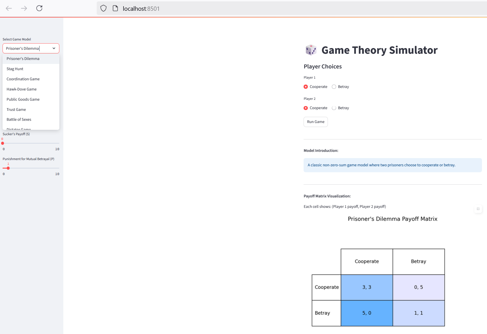

# Game Theory Simulator

This project is a game theory simulator supporting multiple classic game models, with an interactive UI built using Streamlit. It allows users to intuitively experience and compare the characteristics of different models.

## Supported Game Models
- **Prisoner's Dilemma**: Classic non-zero-sum game about cooperation and betrayal
- **Stag Hunt**: Game examining trust and collaboration with risk
- **Coordination Game**: Demonstrates the importance of coordination in social situations
- **Hawk-Dove Game**: Conflict model examining aggressive vs. passive behavior (also known as Chicken Game)
- **Public Goods Game**: Explores tension between individual and group interests
- **Trust Game**: Economic game exploring trust and reciprocity
- **Battle of Sexes**: Coordination game with conflict of interest
- **Dictator Game**: Simple economic game exploring fairness and altruism

## Main Features
- Supports simulation and parameter setting for various game models
- Interactive web interface for easy operation and result visualization
- Clear structure, easy to extend with new models

## Quick Start
1. Install dependencies:
   ```bash
   pip install -r requirements.txt
   ```
2. Run the simulator:
   ```bash
   streamlit run app.py
   ```

## Screenshots



## Directory Structure
- app.py: Streamlit frontend entry
- models/: Implementations of each game model
- requirements.txt: Dependency list

## Further Extension
You can add more game models in the models directory to achieve richer simulation functions.
